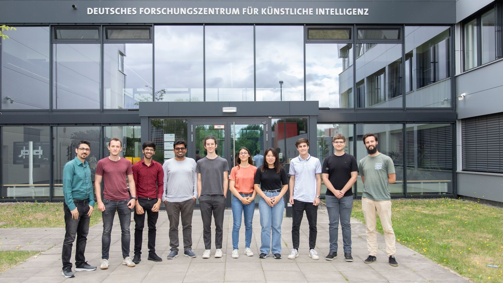

# Event Summary

The [Underactuated Lab](https://robotik.dfki-bremen.de/en/research/research-facilities-labs/underactuated-lab/) at [DFKI Robotics Innovation Center](https://robotik.dfki-bremen.de/en/startpage.html) is committed to pushing the limits of our robots in order to achieve animal-like physical/athletic intelligence. The lab is hosting a bunch of exchange students this summer with diverse backgrounds from all over the world with a shared vision of developing athletic intelligence for underactuated robotic systems. The Summer of Underactuation 2022 event intends to highlight the scientific work of the exchange students working with the underactuated lab to everyone working at DFKI-RIC. We invite you to join us over lunchtime on **15.07.22 (Friday) from 12:00 to 15:00 in B0.10 seminar room** to enjoy monkey like brachiation movements of Acromonk robot, jumping with monopeds, balance of legged systems, latest insights into reinforcement learning for achieving dynamic movements, design and motion co-optimization for quadrupeds and how we can generate stability certificates for the control of underactuated systems. 

| Time Slot      | Title of the presentation                                                                       | Speaker              |
|----------------|-------------------------------------------------------------------------------------------------|----------------------|
| 12:00 - 12:05  | [Welcome Note](#welcome-note-by-prof.-frank-kirchner)                                           | Prof. Frank Kirchner |
| 12:05 - 12:15  | [Foreword: Summer of Underactuation 2022](#foreword-summer-of-underactuation-2022-by-dr.-shivesh-kumar)             | Dr. Shivesh Kumar    |
| 12:15 - 12:30  | [Mechatronic Design and Control of an Underactuated Brachiation Robot](#mechatronic-design-and-control-of-an-underactuated-brachiation-robot-by-mahdi-javadi)                            | Mahdi Javadi         |
| 12:30 - 12:45  | [Underactuated Brachiation on the AcroMonk System](#underactuated-brachiation-on-the-acromonk-system-by-paula-stocco)                                                | Paula Stocco         |
| 12:45 - 13:00  | [RoA Computation via Lyapunov based methods  for Canonical Underactuated Robots](#roa-computation-via-lyapunov-based-methods-for-canonical-underactuated-robots-by-federico-girlanda)                  | Federico Girlanda    |
| 13:00 - 13:15  | [Balancing of Humanoid Robots using Linear  Quadratic Regulators](#balancing-of-humanoid-robots-using-linear-quadratic-regulators-by-noah-wechtler)                                 | Noah Wechtler        |
| 13:15 - 13:45  | Lunch Break and Open Discussion (Free Pizzas)                                                   |                      |
| 13:45 - 14:00  | [Development and Analysis of Reinforcement  Learning based controllers for Underactuated Systems](#development-and-analysis-of-reinforcement-learning-based-controllers-for-underactuated-systems-by-raghav-soni) | Raghav Soni          |
| 14:00 - 14:15  | [Optimal Design of a Variable Stiffness Leg](#optimal-design-of-a-variable-stiffness-leg-by-jungmin-lim)                                                      | Jungmin Lim          |
| 14:15 - 14:30  | [Monocular Vision - based Hazard Detection for  Autonomous Landing on Comets and Asteroids](#monocular-vision-based-hazard-detection-for-autonomous-landing-on-comets-and-asteroids-by-pelayo-peñarroya)       | Pelayo Peñarroya     |
| 14:30 - 14:45  | [Design and Control Co-optimization for Legged Robots](#design-and-control-co-optimization-for-legged-robot-by-gabriele-fadini )                                            | Gabriele Fadini      |
| 14:45 - 15:00  | [Monoped Hopping, Spatial Motion, and  Robust Experimental Setups](#monoped-hopping-spatial-motion-and-robust-experimental-setups-by-antonio-lópez-rivera)                                | Antonio López Rivera |

# Event Video Proceedings

In the following, you can find the video proceedings from the event. The recorded talks include the presentations and live demonstrations on real prototypes. 

## Welcome Note by Prof. Frank Kirchner

This talk is a brief welcome address from the director of Robotics Innovation Center, DFKI GmbH, Prof. Frank Kirchner. The talk starts with a brief history of brown bag talk events at the institute and talks about the establishment of the underactuated lab which is built around the ideology of free to think, free to test and free to fail. 

<video src="static/videos/part_01/Frank_Kirchner.mp4" controls="controls" style="max-width: 48em;"> </video>

## Foreword: Summer of Underactuation 2022 by Dr. Shivesh Kumar 

This talk is a foreword on the summer of underactuation event 2022. The event is hosted by the underactuated lab which has been established at DFKI Robotics Innovation Center since 2021. The underactuated lab is the flagship project of the Advanced AI Team: Mechanics & Control at the institute. The talk provides some information on the team structure and its vision, introduces the problem of underactuation and presents some recent achievements of the underactuated lab. 

<video src="static/videos/part_01/Shivesh_Kumar.mp4" controls="controls" style="max-width: 48em;"> </video>

## Mechatronic Design and Control of an Underactuated Brachiation Robot by Mahdi Javadi

The talk addresses the mechatronics integration and optimal locomotion of an ape-like brachiation robot called AcroMonk. AcroMonk is a portable wireless robot with an onboard battery, seeking to imitate the swing motion of the apes and gibbons. Optimal locomotion for this robot is composed of trajectory optimization and stabilization. The brachiation is split into sub-behaviors, and the optimized trajectories are designed with the Direct collocation method. Time-Varying Linear Quadratic Regulator (TVLQR) and Proportional-Derivative (PD) controller are employed for trajectory stabilization purposes. The mechatronics's design functionality and proposed locomotion strategies of some sub-behaviors are evaluated through simulation and hardware experiments.

<video src="static/videos/part_01/Mahdi_Javadi.mp4" controls="controls" style="max-width: 48em;"> </video>

## Underactuated Brachiation on the AcroMonk System by Paula Stocco

AcroMonk is an underactuated system designed in-house to achieve brachiation, the motion primates make when swinging through canopies and across monkey bars. This project builds on prior achievements using the existing hardware design and fundamental motions. Using the control principles previously employed, direct collocation for trajectory optimization and Time-Varying Linear Quadratic Regulator (TVLQR) for trajectory stabilization, we now aim to complete the full brachiation motion by chaining several fundamental motions. Additional goals are to use the cyclic natural of brachiation to achieve several swings in a row, with the intention of bringing underactuated systems closer to realizing full robotic motion.

<video src="static/videos/part_01/Paula_Stocco.mp4" controls="controls" style="max-width: 48em;"> </video>

## RoA computation via Lyapunov-based methods for canonical Underactuated robots by Federico Girlanda

The region of attraction(RoA) estimation gives an intuitive point of view to the controller robustness to uncertainty in the environment, parametric model uncertainty, and disturbances. It comes up with a state space representation of the set of states that are guaranteed to be stabilized despite the non-idealities. The different methods considered are the SOS approach and a simulation-based probabilistic one. Both methods have been implemented for a time-invariant RoA analysis and recently also in their time-varying version. These results have been validated using the torque-limited simple pendulum of the underactuated laboratory.

<video src="static/videos/part_01/Federico_Girlanda.mp4" controls="controls" style="max-width: 48em;"> </video>

## Balancing of Humanoid Robots using Linear Quadratic Regulators by Noah Wechtler

Balancing is a task humans learn early on in their life, which plays a vital role in performing everyday tasks. Naturally, a humanoid robot whose task it is to interact with the environment should be capable of balancing even when disturbances are present. In the early days of humanoid control, joints were individually position controlled with high gain PID controllers. This contrasts with humans, which instinctively use their entire body to balance. While PID controllers are a powerful tool due to the rich linear control literature, it is difficult to capture the complex couplings between the joints of a humanoid, which leads to unnatural looking movement of the robot. The Linear Quadratic Regulator (LQR) appears like a promising method to include information about joint couplings locally, while staying in the realm of linear control theory. The LQR controller will be implemented on the RH5 robot. The controllers’ disturbance rejection capabilities will then be tested via push tests. 

<video src="static/videos/part_01/Noah_Wechtler.mp4" controls="controls" style="max-width: 48em;"> </video>

## Development and analysis of Reinforcement learning based controllers for underactuated systems by Raghav Soni

One of the major barriers in implementing the RL algorithms on real systems is simulation to reality gap, also known as sim2real gap. The goal of the project is to develop controllers for various underactuated systems using Reinforcement Learning with a special emphasis on trying to narrow the sim2real gap by either trying to train directly on the real system when possible, making the policies robust by introducing additional disturbances or by making the simulations more accurate by doing system identification. The developed controllers will be compared with the classical controllers in terms of performance and tuning required.

<video src="static/videos/part_02/Raghav_Soni.mp4" controls="controls" style="max-width: 48em;"> </video>

## Optimal Design of a Variable Stiffness Leg by Jungmin Lim

Optimality is a crucial criterion for many machine applications and robots, often determining their success or failure. In nature, evolutionary processes created a wealth of successful or optimal organisms. Similarly, optimal designs are often sought in engineering applications, bearing two main challenges. First, the scope of optimality and the set of considered parameters must be defined. As such, optimal design is e.g., connected to mechanism synthesis at one end and optimal control to the other. Second, the task of the machine and its underlying criteria for optimality must be defined. In the context of variable stiffness mechanisms, a jumping leg will be devised, giving rise to optimal design strategies. The possibility of incorporating snap-through instabilities is one of the aspects that can lead to a successful implementation. 

<video src="static/videos/part_02/Jungmin_Lim.mp4" controls="controls" style="max-width: 48em;"> </video>

## Monocular Vision-based Hazard Detection for Autonomous Landing on Comets and Asteroids by Pelayo Peñarroya

Future space missions will include large-scale exploration of asteroids and comets for scientific purposes and for resource collection. Many missions require autonomous systems for landing due to round-trip communication delays. The autonomous landing systems will require the knowledge of hazards on the surface of the asteroid/comet so that it can perform guidance and control to ensure a safe landing. Machine learning-based methods were developed at Deimos Space in Madrid for detecting hazards using a monocular camera and these were trained and validated on synthetic images. At DFKI, the hazard detection methods were validated and improved using images taken in space-like lighting conditions in the space hall. 

<video src="static/videos/part_02/Pelayo_Penarroya.mp4" controls="controls" style="max-width: 48em;"> </video>

## Design and Control co-optimization for legged robot by Gabriele Fadini 

Co-design is a novel method to optimize robotic platforms. It simultaneously selects the optimal hardware and motion in order to achieve a desired task. Leveraging the robot properties and its dynamics leads to designs with outstanding performance. The framework we developed at LAAS-CNRS optimizes motion, actuators and the scaling of the structure in order to ensure energy efficiency and controller robustness. The plan for the near future is to utilize our optimization tools in the case of more challenging robots and tasks collaborating with DFKI for the optimization and final realization of a new quadruple prototype. 

<video src="static/videos/part_02/Gabriele_Fadini.mp4" controls="controls" style="max-width: 48em;"> </video>

## Monoped Hopping, Spatial Motion, and Robust Experimental Setups by Antonio López Rivera

The goal of this project is to create a testbench to research underactuated control algorithms for jumping and spatial motion with monopeds. The chief milestones and challenges in the development of the system will be discussed, and circular motion of the monoped will be demonstrated. Lastly, development for systems undergoing fast iteration and the interface developed between control and low-level logic to tackle it will be discussed. The focus of research in the immediate future is on advanced spatial motion algorithms, and work will continue to refine the system and its accessories, improving their role as a multi-purpose test bench. 

<video src="static/videos/part_02/Antonio_Lopez_Rivera.mp4" controls="controls" style="max-width: 48em;"> </video>

